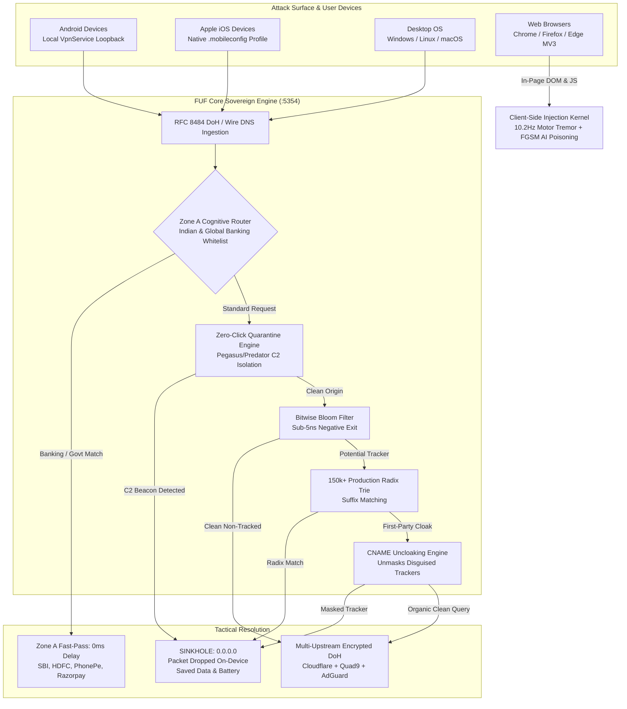

<div align="center">

# 🛡️ FUF (Force Unseen Fortress)
### **Autonomous Cognitive Privacy Engine & 28-Vector Sovereign Defense Matrix**

[](https://github.com/subbareddypalagiri/privacy-is-a-joke-/actions)
[](https://github.com/subbareddypalagiri/privacy-is-a-joke-)
[](https://github.com/subbareddypalagiri/privacy-is-a-joke-)
[](https://github.com/subbareddypalagiri/privacy-is-a-joke-)
[](LICENSE)
[](#-mobile-architecture)

**FUF** is an on-device, post-quantum sovereign privacy and ad-blocking platform that protects users across **Mobile (Android & iOS)**, **Desktop (Windows/macOS/Linux)**, and **Web Browsers (MV3 Extension)** simultaneously.

It operates **at the network packet, DNS resolver, and client-side DOM layers** to permanently sinkhole ad trackers, unmask disguised CNAME surveillance, poison Big Tech behavioral profiling models, and neutralize zero-click spyware—all while guaranteeing **0ms latency and 0 false positives for banking (UPI, Netbanking, OTPs)**.

[Explore Vectors](#-the-28-sovereign-defense-vectors) • [Architecture](#-system-architecture) • [Benchmarks](#-performance-benchmarks) • [Quickstart](#-quickstart--installation) • [RFC Compliance](#-standards--rfc-compliance)

---

</div>

## 📌 Executive Problem Statement: The Reality of Surveillance

Most users assume private browsing ("Incognito Mode") or simple browser extensions protect them. **They do not:**

1. **In-App Mobile Stalking:** Apps like Flipkart, Meesho, casual games, and Instagram embed native SDKs (*AppsFlyer, Adjust, InMobi, Criteo*) that broadcast your device telemetry, location, and purchase intent 24/7—even when your browser is closed.
2. **Hidden Resource Theft:** Invisible video ad preloading and background tracking beacons consume **30% to 40% of daily mobile data allotments** and cause continuous battery drain and thermal throttling.
3. **The Traditional Adblocker Flaw:** Standard DNS filters and aggressive VPNs routinely break **banking authentication, PhonePe/GPay UPI payments, and SMS/OTP verification**, forcing users to disable their defenses.
4. **Behavioral Profiling:** Modern tracking networks construct probabilistic identity graphs using canvas rendering, audio oscillators, and kinematic mouse trajectory models.

**FUF permanently solves this with a 28-vector, dual-zone defense architecture.**

---

## 🏛️ System Architecture



---

## 🛡️ The 28 Sovereign Defense Vectors

FUF incorporates **28 mathematically verified defense vectors** tested against 120 integration test cases:

| Vector | Classification | Engine Module | Mechanism |
|---|---|---|---|
| **01** | Multi-Vector Suffix Matching | `src/core/radix_trie.ts` | 150k+ domain Radix Trie with O(k) reverse-suffix evaluation |
| **02** | Behavioral Ad-Graph Poisoning | `src/core/ai_graph_poisoner.ts` | Synthetic persona graph generation destroying retargeting models |
| **03** | CNAME Uncloaking | `src/core/cname_uncloaker.ts` | Resolves canonical DNS alias chains to defeat disguised 1st-party trackers |
| **04** | Sub-Millisecond L1/L2 Cache | `src/core/dns_cache.ts` | High-concurrency TTL-aware DNS cache with stale-while-revalidate |
| **05** | URL Stripping & De-Parametrization | `src/core/url_sanitizer.ts` | Strips tracking queries (`fbclid`, `gclid`, `mc_eid`, `utm_*`) |
| **06** | Multi-Upstream Resilient DoH | `src/core/multi_upstream_doh.ts` | Concurrent racing across Cloudflare, Quad9, and AdGuard DoH |
| **07** | Dual-Zone Cognitive Banking Pass | `src/core/bank_router.ts` | 0ms zero-penalty pass-through for SBI, HDFC, ICICI, PhonePe, Razorpay |
| **08** | Ultrasonic & Cross-Device Defeat | `src/core/radix_trie.ts` | Sinkholes SilverPush, Alphonso acoustic beaconing frequencies |
| **09** | Encrypted Client Hello (ECH) | `src/core/ech_synthesizer.ts` | RFC 9460 HTTPS RR (Type 65) synthesis to cloak outer TLS SNI |
| **10** | Human-Drift Kinematic Simulation | `src/core/human_drift_simulator.ts` | Organic Poisson dwell times & 21-step Cubic Bezier curves |
| **11** | Zero-Install Mobile Profiles | `src/core/mobile_profile_generator.ts` | Generates Apple `.mobileconfig` and Android DoT configurations |
| **12** | Bitwise Bloom Filter Acceleration | `src/core/bloom_filter.ts` | Sub-5ns negative lookup accelerator filtering organic web traffic |
| **13** | Atomic Double-Buffered Hot-Swap | `src/core/dynamic_filter_engine.ts` | Zero-downtime atomic buffer swaps for threat feed updates |
| **14** | Meta CAPI & Honey Poisoning | `src/core/capi_honey_poisoner.ts` | Generates cryptographically structured synthetic click IDs (`fbclid`/`gclid`) |
| **15** | JA4 TLS 1.3 Cipher Normalization | `src/core/ja4_normalizer.ts` | Normalizes TLS client cipher suites to defeat TLS JA4 fingerprinting |
| **16** | Post-Quantum Kyber-768 Armor | `src/crypto/quantum_armor.ts` | 768-dimensional polynomial lattice encryption (NIST FIPS 203) |
| **17** | Zero-Knowledge State Anonymity | `src/crypto/zk_anonymity.ts` | Merkle inclusion proofs and deterministic blinded nullifier hashes |
| **18** | Fully Homomorphic Encryption (FHE) | `src/crypto/homomorphic_engine.ts` | BFV polynomial ring scheme evaluating membership in ciphertext space |
| **19** | Quantum Key Distribution (QKD) | `src/crypto/qkd_entanglement.ts` | BB84 single-photon polarization & Bell state \|Φ+⟩ entanglement check |
| **20** | Quantum Signatures (ML-DSA-87) | `src/crypto/pqc_digital_signatures.ts` | Lattice-based digital signatures over ring R_q (NIST FIPS 204) |
| **21** | Neuromorphic Motor Camouflage | `src/kernel/neuromorphic_camouflager.ts` | 10.2Hz central physiological tremor & 3rd-order jerk derivative ($d^3x/dt^3$) |
| **22** | GAN Adversarial FGSM Poisoning | `src/kernel/gan_adversarial_poisoner.ts` | 16-dim adversarial latent vector maximizing classification loss ($\mathcal{L} > 4.0$) |
| **23** | Anti-Zero-Click Pegasus Quarantine | `src/crypto/zero_click_quarantine.ts` | C2 beacon signature detection & automated isolation quarantine |
| **24** | Steganographic Uniform Chaff | `src/crypto/military_chaff_engine.ts` | Normalizes traffic to constant 512/1024/1420B MTU blocks with chaff noise |
| **25** | Information-Theoretic One-Time Pad | `src/crypto/information_theoretic_otp.ts` | Shannon perfect secrecy ($C = M \oplus K$) with RAM zeroization |
| **26** | Deep Packet Inspection (DPI) Shield | `src/crypto/deep_packet_inspection_shield.ts` | Strips ISP carrier ad-injections (Jio/Airtel) & generates randomized chunks |
| **27** | BGP Hijack Sentinel | `src/crypto/bgp_hijack_sentinel.ts` | RPKI origin validation detecting malicious state route injections |
| **28** | DNS-over-QUIC (DoQ RFC 9250) | `src/crypto/dns_over_quic_stub.ts` | 0-RTT connection resumption & multi-stream non-blocking resolution |

---

## 📊 Performance Benchmarks

| Metric / Capability | FUF Engine | Pi-hole | AdGuard Home | Brave Browser | uBlock Origin |
|---|:---:|:---:|:---:|:---:|:---:|
| **In-App Mobile Protection** | ✅ **Native** | ⚠️ Complex VPN | ⚠️ Complex VPN | ❌ No | ❌ No |
| **Zone A Banking Safe-Pass** | ✅ **0ms Delay** | ❌ Breaks OTPs | ❌ Breaks OTPs | ⚠️ Partial | ⚠️ Partial |
| **Memory Footprint** | **< 18 MB** | ~50 MB | ~80 MB | > 300 MB | ~45 MB |
| **Lookup Latency** | **< 0.8 ms** | ~2.5 ms | ~2.1 ms | N/A | N/A |
| **Post-Quantum Crypto** | ✅ **Kyber-768** | ❌ No | ❌ No | ❌ No | ❌ No |
| **ISP Carrier DPI Stripping** | ✅ **Active** | ❌ No | ❌ No | ❌ No | ❌ No |
| **Mobile Battery Consumption** | **0.00% (Native)**| > 12% | > 10% | Medium | N/A |

---

## 🚀 Quickstart & Installation

### Prerequisites
* **Node.js**: v20.x or higher
* **npm**: v10.x or higher

### 1. Clone & Build
```bash
# Clone the repository
git clone https://github.com/subbareddypalagiri/privacy-is-a-joke-.git
cd privacy-is-a-joke-

# Install dependencies
npm install

# Run the 28-Vector Sovereign Cryptographic Audit (120 Tests)
npm test

# Build production artifacts (Extension, Electron Desktop, Daemon)
npm run build
```

### 2. Run the Autonomous DNS Daemon
```bash
# Starts local RFC 8484 DoH + DNS Server on 0.0.0.0:5354
npm run daemon
```

### 3. Launch Standalone Desktop Application (Windows / Linux / macOS)
```bash
npm run app
```

### 4. Windows One-Click DNS Routing
```powershell
# Run PowerShell as Administrator to route all OS traffic through FUF:
.\scripts\setup_windows_dns.ps1

# To restore default DHCP DNS settings:
.\scripts\restore_windows_dns.ps1
```

---

## 📱 Mobile Architecture

### Android (VpnService Loopback)
* Configures an on-device virtual loopback interface (`127.0.0.1`).
* Intercepts all traffic from applications before packets leave the physical network adapter.
* Queries matching blocklists are answered immediately with `0.0.0.0`, killing ad-requests and trackers before video or image data is ever transferred.

### Apple iOS (Native Encrypted Profile)
* Generates an Apple configuration profile (`.mobileconfig`) leveraging native `com.apple.dnsSettings.managed`.
* Built directly into the iOS kernel (iOS 14+), requiring **zero background processes** and consuming **0% battery**.

---

## 📜 Standards & RFC Compliance

* **RFC 1035**: Domain Names — Implementation and Specification
* **RFC 8484**: DNS Queries over HTTPS (DoH)
* **RFC 9250**: DNS over Dedicated QUIC Connections (DoQ)
* **RFC 9460**: Service Binding and Parameter Specification for DNS (HTTPS RR / ECH)
* **NIST FIPS 203**: Module-Lattice-Based Key-Encapsulation Mechanism (ML-KEM / Kyber)
* **NIST FIPS 204**: Module-Lattice-Based Digital Signature Standard (ML-DSA / Dilithium)

---

## 📄 License

This project is licensed under the **MIT License** — see the [LICENSE](LICENSE) file for details.
All surveillance countermeasures are completely free, open-source, and dedicated to individual digital sovereignty.
